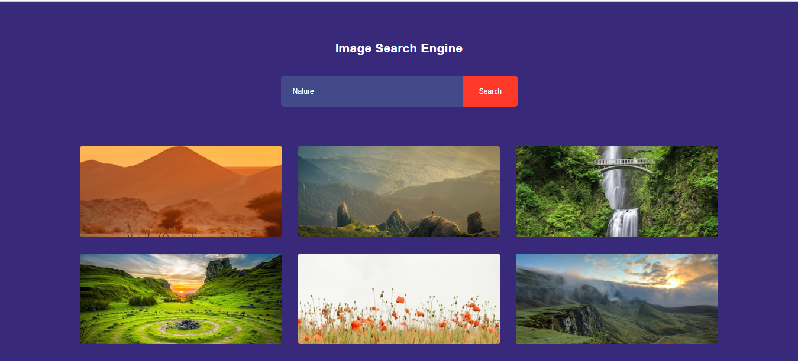

# Vihara Senindu Image Search Engine ⚡️
Introducing our innovative image search engine, a powerful tool that allows users to find visually similar images effortlessly. With cutting-edge technology and a vast database, our platform provides accurate results, making it ideal for creative professionals, researchers, and anyone seeking quick, precise image matches.



## How To Use 

```bash

# Clone this repository
git clone https://github.com/vihara-senindu/image-search-engine

```
## Language & Technology Used 

- [HTML](https://en.wikipedia.org/wiki/HTML5)
- [CSS](https://en.wikipedia.org/wiki/CSS)
- [JAVASCRIPT](https://en.wikipedia.org/wiki/JavaScript)

## Developer
- [Creator](https://github.com/Vihara-Senindu)
